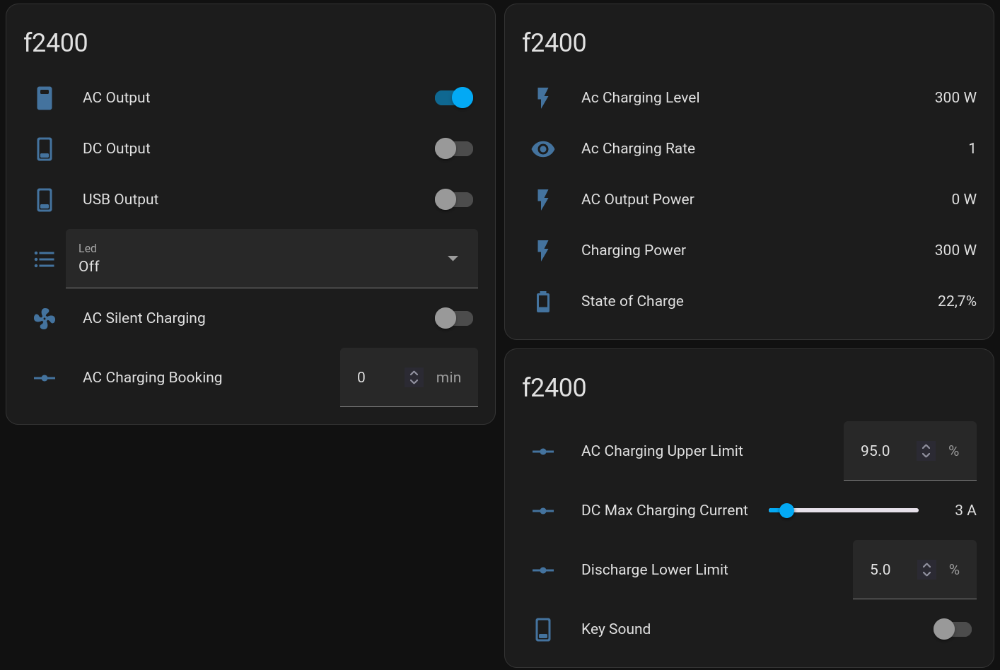

# LeSyd - A MQTT wrapper for Sydpower/Fossibot/... portable energy stations

[!WARNING]
LeSyd is still in early active developpement. Changes that break existing configurations are likely to happen. 

LeSyd is a python scripts that translate the binary MQTT messages used by the Sydpower/Fossibot energy stations into user-friendly MQTT messages.

LeSyd can also replace the [Fossibot Home Assistant integration](https://github.com/iamslan/fossibot).

IMPORTANT: The connection to the Sydpower mqtt server is not yet implemented. For now, Lesyd requires a WiFi connection that redirects `mqtt.sydpower.com` to a local server. 

## Changelog

2025-04-21 : Added proper logging support.
2025-04-20 : Added proper support for TLS connections (not tested)
2025-04-20 : First version


## Known issues / TODO LIST

- Not tested with AFERIY batteries such as the P210 and P310. That may work or brick your device so, please, contact me if you own one of those.
- Probably a lot of small bugs an typos everywhere. Do not hesitate to fill bug reports.
- options `extension1` and `extension2` are not yet implemented. The StateOfCharge is not reported for extension batteries.
- Changing the value of number entities (`ac_charging_booking`, `dc_max_charging_current`, `discharge_lower_limit`, ...) is not smooth at all in HomeAssistant: There is too much traffic and lag between HA, LeSyd and the device.
- Implement the connection to the real `mqtt.sydpower.com` located in China. The method is known but I am not convinced that this is worth the effort: Too slow and too many disconnects. 

## References

- The [Fossibot Home Assistant integration](https://github.com/iamslan/fossibot) is where everything started.
- [Sydpower-MQTT](https://github.com/schauveau/sydpower-mqtt) is a python script I wrote to help reverse engineer the MQTT messages used by the Sydpower/Fossibot devices. 

## FAQ

### Why LeSyd?

Because of Sydpower, the OEM company that provides the devices.

Also, I am French and this is a reference to [Le Cid](https://en.wikipedia.org/wiki/Le_Cid), a well known French tragicomedy written by Pierre Corneille in 1636.

## How to redirect the device MQTT traffic?

The goal here is to change the DNS entry for `mqtt.sydpower.com` so that it points to a server running another MQTT Broker.

On most home networks, that can be done in the DNS settings of the WiFi router by adding an entry for `mqtt.sydpower.com`.

If your WiFi router cannot do that of if you do not configure it then your only alternative is probably to create a new WiFi hostspot.

The device may have to be restarted in order to connect to the fake `mqtt.sydpower.com`.

Note: The official BrightEMS application will not work properly on a WiFi network with a fake `mqtt.sydpower.com`. Bluetooth connections are still possible but only with an internet connection where `mqtt.sydpower.com` is not redirected.

The MQTT broker on the redirected `mqtt.sydpower.com` must allow anonymous non-encrypted tcp connections on port 1883.

Remark: the device still need internet access ; probably to obtain MQTT credentials from the Sydpower Cloud. Of course, those credentials will not be needed since the local MQTT broker allows for anonynous connections but unfortunately, the device does not know that.   

If your MQTT server is already using port 1883 without anonymous access, the you may want to move all your MQTT clients to another ports (see below for an example with Mosquitto). An alternative is to install a second MQTT broker on another machine (see `mqtt_sydpower` in the configuration file of LeSyd). 


### Example using the Mosquitto broker

Here is the required configuration for the listener: 

```
per_listener_settings true

listener 1883
protocol mqtt
allow_anonymous true
```

Now, if you want to reuse the same MQTT broker for LeSyd, HomeAssistant, or other client then you probably want to secure with a second listener port that does not allow anonymous access:

Your Mosquitto listener configuration could look like that:

```
listener 1884 
allow_anonymous false
password_file /etc/mosquitto/passwords

# Listener used by the Fossibot device.
listener 1883
protocol mqtt
allow_anonymous true
acl_file /etc/mosquitto/acl-sydpower-device
```

The ACL file `/etc/mosquitto/acl-sydpower-device` is used to restrict what can be done using port 1883.

If your device MAC address is '7C2C34AEF1AA' then the file should contain  

```
pattern read  7C2C34AEF1AA/client/#
pattern write 7C2C34AEF1AA/device/#
```
or to allow read and write for everyone
```
pattern readwrite 7C2C34AEF1AA/#
```

Note: 'pattern' cannot be omited here because this is a not a true anonymous connection. The device is connecting with a username and a password obtained from the cloud. `pattern` rules are the only ones that are applied to ALL users.

## LeSyd Requirements

- Python 3.13.3
- Python packages:
   - paho-mqtt  2.1.0 
   - yaml 6.0.2
   - yamale 6.0.0
   
The package versions are only indicative of what I am currently using. LeSyd probably works fine with slightly older versions.

All Python packages can be installed using `pip3`, `pipx` or from system packages on most Linux distributions.

- Debian: `apt install python3-paho-mqtt python3-yaml python3-yamale`

It the system packages are missing or not compatible then a solution can be to install then in a local virtual environment using `venv`.

For example, assuming that LeSyd is installed in `/opt/lesyd`, do
 
```
python3 -m venv /opt/lesyd/venv
. /opt/lesys/venv/bin/activate
pip install paho-mqtt==2.1.0
pip install yamale
```

and then start LeSyd with a shell script like this one:

```
#!/bin/sh
. /opt/lesyd/venv/bin/activate
/opt/lesyd/lesyd/lesyd.py "$@" 

```

## Using LeSyd

Lets assume that you are using an MQTT server with port 1884 enabled and a Fossibot F2400 with MAC address `7C2C67ABFD1`

A basic configuration file could look like that:

```
global:
  loglevel: info
  ha_discovery: false
  
mqtt_client:
  hostname: 'mymqtt.mydomain'   
  port: 1884
  username: 'USERNAME'  
  password: 'PASSWORD'  

# Reminder: All entries in the device section must use a lowercase MAC address.
devices:
  '7c2c67abfd1a':
     name:   'myf2400'
     preset: 'F2400-B'
     input_refresh: 3
     holding_refresh: 30
     state_refresh: 30
```

See [configuration.md](configuration.md) for a more detailed description of the YAML configuration file.

Start LeSyd with

```
python3 lesyd.py -c config.yaml 
```

In case of success, the device state should be published at regular interval on topic `/lesyd/7c2c67abfd1a/#` with a json payload. 

If nothing happens then that probably means that the MQTT server is not properly connected to the device.

## Features

### Quick overview of the values provided by LeSys

Below are the names used in the MQTT state (a JSON structure). Unneeded entities can be disabled in the configuration file (see the `exclude` in the device options).  

In Home Assistant, the entities are named by prefixing them with the device name. 

See  for a more detailed description of each value. 

- `ac_charging_booking` (RW)
 
- `ac_charging_level`
 
- `ac_charging_power`

- `ac_charging_rate`

- `ac_charging_upper_limit` (RW) 
 
- `ac_input_power`
 
- `ac_output_power`

- `ac_output` (RW)
  
- `ac_silent_charging` (RW)
  
- `charging_power`
  
- `dc_charging_power`

- `dc_max_charging_current` (RW)
 
- `dc_output_power`

- `dc_output` (RW)
  
- `discharge_lower_limit` (RW)
 
- `key_sound` (RW) 
 
- `led` (RW)
 
- `state_of_charge` 
  
- `total_input_power` 
  
- `usb_output_power`
 
- `usb_output` (RW)


## Home Assistant with MQTT auto-discovery

If you have Home Assistant with the MQTT integration then enable `ha_discovery` in theconfiguration file.

A new device should appear in the MQTT integration with the specified name (that would be `myf2400` in the previous example).

 Here is a screenshot of HomeAssistant showing the entities for a Fossibot F2400 (May 22th 2025). 



